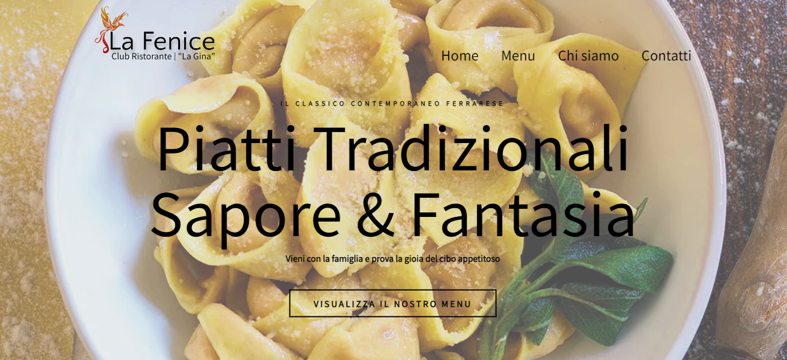

<h1 align="center">
    
</h1>
<h2 align="center">
    
    <span>🔗</span><a href="https://la-fenice-ristorante.vercel.app/">Live Demo</a> 
</h2>

## 📕 About
#### La Fenice is a fully responsive restaurant website. Responsive for all devices, build using HTML, CSS, TypeScript and React.

### Prerequisites

Before you begin, ensure you have met the following requirements:

* [Git](https://git-scm.com/downloads "Download Git") must be installed on your operating system.

### Run Locally

To run **La Fenice** locally, run this command on your git bash:

Linux and macOS:

```bash
sudo git clone https://github.com/devjeanfraga/la-fenice-ristorante.git
```

Windows:

```bash
git clone https://github.com/devjeanfraga/la-fenice-ristorante.git
```

## 🔨 Tools
- [React](https://pt-br.legacy.reactjs.org/)
- [TypeScript](https://www.typescriptlang.org/)
- [HTML](https://developer.mozilla.org/pt-BR/docs/Web/HTML) 
- [CSS](https://developer.mozilla.org/pt-BR/docs/Web/CSS)

## improvements
- Create dashboard for the user to edit the menu. 
- Add English translation.
- Add dark mode.

## 📜 Licence 
[MIT](https://choosealicense.com/licenses/mit/)